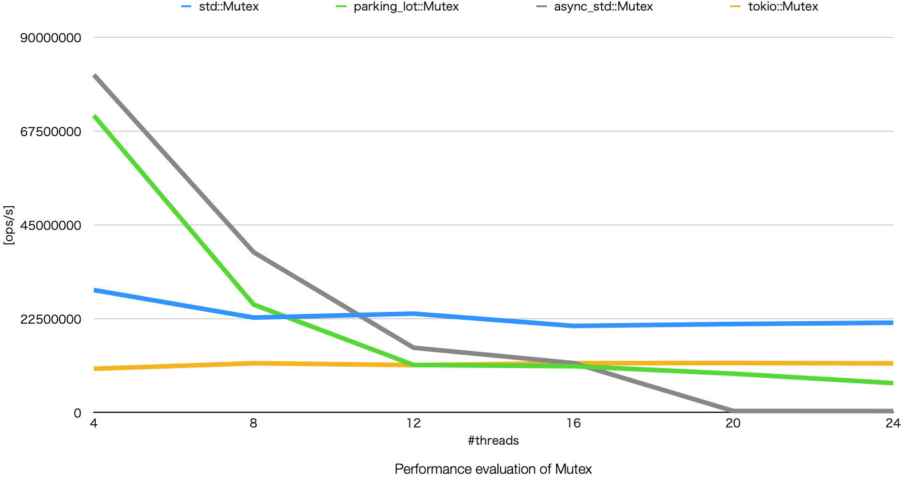

# Performance Evaluation of Channel and Mutex of Rust

Author: **Yuuki Takano**

This article introduces a performance evaluation of channel and Mutex of Rust. I evaluated channel implementation of `std`, [Crossbeam channel](https://docs.rs/crossbeam-channel/latest/crossbeam_channel/), [flume](https://docs.rs/flume/latest/flume/index.html), [async-std](https://async.rs/), and [Tokio](https://tokio.rs/), and Mutex implementation of `std`, [parking_lot](https://docs.rs/parking_lot/latest/parking_lot/index.html), [async-std](https://async.rs/), and [Tokio](https://tokio.rs/).

---

## Channel

### Summary

- [Crossbeam channel](https://docs.rs/crossbeam-channel/latest/crossbeam_channel/) is the fastest. Use this for multi-threaded applications.
- [async-std](https://async.rs/) is quite better than [Tokio](https://tokio.rs/) from a view point of performance.

### Evaluation Environment

- CPU
  - AMD Ryzen 9 5900HX with Radeon Graphics
  - 8 cores, 16 threads
  - 3.3GHz, 4.6GHz (turbo boost)
  - 4MB L2 cache, 16MB L3 cache
- Memory
  - 64GB memory
  - 32GB DDR4 x 2
  - 3200 MT/s

### One-to-one

I evaluated one-to-one communications, which means 1 sender and 1 receiver.

These figures describe how many messages can be sent in a second; higher is better.
Y-axis is operations per second, and X-axis is the number of pairs.
The left figure shows about unbounded channel, and the right figure
shows about bounded channel.

As shown in these figures, [Crossbeam channel](https://docs.rs/crossbeam-channel/latest/crossbeam_channel/) is the fastest.
In addition to that, [async-std](https://async.rs/) is quite better than [Tokio](https://tokio.rs/) and `std`.

### PDF

This section shows PDF of latency of channels.

#### Unbounded Channel

/violin.svg)

This figure shows PDF of latency of each unbounded channel.
Y-axis is channel, and X-axis is latency.
As shown in this figure, [async-std](https://async.rs/)'s jitter is high when contention is low.
[Crossbeam channel](https://docs.rs/crossbeam-channel/latest/crossbeam_channel/) achieves low jitter.

### Bounded Channel

/violin.svg)

This figure shows PDF of latency of each bounded channel.
Y-axis is channel, and X-axis is latency.
Similar to the unbounded channels,
[async-std](https://async.rs/)'s jitter is high when contention is low.

### Many-to-one

I evaluated many-to-one communications, which means N senders and 1 receiver.

This figure describes how many messages can be sent in a second; higher is better.
Y-axis is operations per second, and X-axis is the number of senders.

As shown in this, [Crossbeam channel](https://docs.rs/crossbeam-channel/latest/crossbeam_channel/) and [async-std](https://async.rs/) are better than others.

---

## Mutex

### Summary

- Mutexes of `std` and [Tokio](https://tokio.rs/) are not so fast but quite stable.
- When contention is low, [parking_lot](https://docs.rs/parking_lot/latest/parking_lot/index.html) is better than `std`, but when contention is high [parking_lot](https://docs.rs/parking_lot/latest/parking_lot/index.html) is **worse** than `std`.
- When contention is high, [async_std](https://docs.rs/parking_lot/latest/parking_lot/index.html)

### Throughput

To evaluate Mutex, I prepared N threads which acquire and release a lock many times.

This figure shows how many the lock can be acquired in a second.
Y-axis is operations per second, and X-axis is the number of threads; higher is better.

Pay attention that [async_std](https://docs.rs/parking_lot/latest/parking_lot/index.html) of 20 and 24 threads. [async_std](https://docs.rs/parking_lot/latest/parking_lot/index.html) is significantly bad when contention is high. It may cause starvation when high contention.

[Tokio](https://tokio.rs/) and `std` are very stable.
[parking_lot](https://docs.rs/parking_lot/latest/parking_lot/index.html) is better than `std` only when low contention.
So, it is not bad choice using `std`,
and [parking_lot](https://docs.rs/parking_lot/latest/parking_lot/index.html) should be used carefully.

### PDF

This section shows PDF of latency of Mutexes.

This figure shows PDF of latency of each Mutex.
Y-axis is Mutex, and X-axis is latency.

As shown in this figure, both [async_std](https://docs.rs/parking_lot/latest/parking_lot/index.html) and [Tokio](https://tokio.rs/)'s jitter are high.
[parking_lot](https://docs.rs/parking_lot/latest/parking_lot/index.html) and `std` are good form a view point of jitter.
